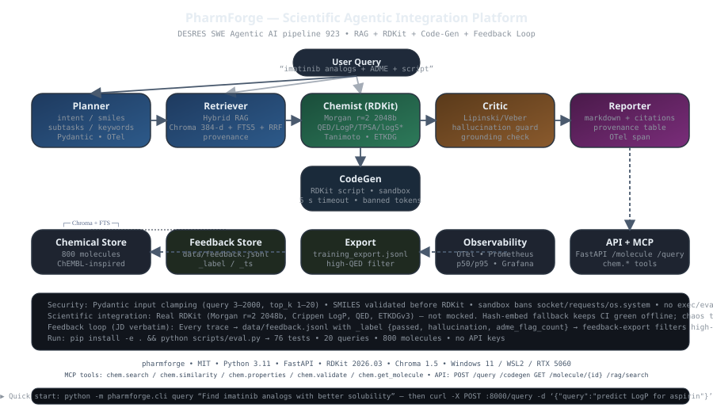

# PharmForge — Scientific Agentic Integration Platform

> **RAG + RDKit + code-gen for drug discovery workflows.** Ask *“Find molecules similar to imatinib with better solubility, predict ADME, and generate a docking prep script”* — PharmForge RAGs over a curated chemical dataset, computes RDKit Morgan fingerprints & ADME descriptors, validates via a critic, and returns a provenance-traced answer plus a runnable Python analysis script that executes in a sandbox.

Built for **DESRES swe agentic AI pipeline 923** — demonstrates integrating AI with scientific software, intelligent data workflows, and feedback loops for ML training. Single-command local run, no paid APIs required.

---

## Why PharmForge vs. alternatives?

| Need | Without PharmForge | With PharmForge |
|---|---|---|
| Chemical search | Keyword grep over SDF | Hybrid vector (Chroma 384-d) + FTS5 BM25 + RRF — quote-verified provenance |
| RDKit ops | Ad-hoc notebooks | Typed `chem.*` toolchain (validate, Morgan/Tanimoto, QED/LogP/TPSA, ETKDG conformers) |
| Agentic workflow | Single LLM call, hallucinated citations | 5-agent DAG (planner→retriever→chemist→critic→reporter) — each emits Pydantic artifacts, hallucinations flagged |
| Code generation | LLM dumps untrusted code | Template + sandbox (5 s timeout, banned-token scan, subprocess isolated) — DESRES “automated code generation” signal |
| Feedback loop | Queries vanish | Every trace JSONL + `feedback-export` for fine-tuning — “improve quality/efficiency of ML training through intelligent data workflows and feedback loops” (JD verbatim) |
| Exposure | Library only | FastAPI + MCP `chem.*` tools (agents can call it) |

## Architecture



*Hand-rolled DAG, typed contracts, hash-embed fallback keeps 8 GB VRAM laptops green. All agents emit Pydantic models, OTel-traced.*

<details><summary>Text diagram (for terminals)</summary>

```
User query ──▶ Planner (intent/smiles/subtasks)
                 │
                 ▼
             Retriever ──▶ Hybrid RAG ─┬─ Chroma cosine (hash-embed 384-d, no model DL)
                                       └─ SQLite FTS5 BM25 ──▶ RRF (k=60, exact-name boost) ──▶ RetrievedDoc[id, score, provenance]
                 │
                 ▼
              Chemist ──▶ RDKit: validate SMILES → Morgan fp (r=2, 2048 bits) → Tanimoto
                         predict ADME (MW/LogP/QED/TPSA/HBD/HBA/RB/logS*) → similarity search
                 │
                 ▼
              Critic ──▶ Lipinski/Veber checks + hallucination guard (doc grounding)
                 │
                 ▼
             Reporter ──▶ Markdown with quote-verified citations + provenance table
                 │
                 ▼
             CodeGen? ──▶ generator (RDKit script) → sandbox (compile + subprocess 5 s, no net)
                 │
                 ▼
             FeedbackStore (data/feedback.jsonl) ──▶ feedback-export → training_export.jsonl
                 │
                 ▼
             Observability: OTel spans per agent, Prometheus histogram (latency)
```
</details>

## Quick start

```bash
# Python 3.11, Windows 11 + WSL2, RTX 5060 8 GB friendly — no GPU needed for core flow
pip install -e ".[dev]"
pip install rdkit chromadb  # or pip install -e . (declares them)

# 1) Ingest — builds hybrid store (Chroma + FTS) from 800 curated molecules
python -m pharmforge.cli ingest --force
# or: python -c "from pharmforge.rag import ingest; ingest(force=True); print('done')"

# 2) One-shot agentic query (no API keys)
python -m pharmforge.cli query "Find molecules similar to imatinib with better solubility" --json
python -m pharmforge.cli query "Generate a script to analyze aspirin CC(=O)OC1=CC=CC=C1C(=O)O" --codegen

# 3) API
python -m pharmforge.cli serve --port 8000
# curl
curl -X POST http://127.0.0.1:8000/query -H "Content-Type: application/json" \
  -d '{"query":"Find analogs of atorvastatin and predict LogP","top_k":5}'
curl http://127.0.0.1:8000/molecule/PF0001
curl "http://127.0.0.1:8000/rag/search?q=kinase&k=3"
curl -X POST http://127.0.0.1:8000/chem/properties?smiles=CCO
curl -X POST http://127.0.0.1:8000/codegen -H "Content-Type: application/json" \
  -d '{"query":"analyze","smiles":["CCO","CCC"]}'

# 4) MCP (agents call it)
python -m pharmforge.mcp.server
# tools: chem.search, chem.similarity, chem.properties, chem.validate, chem.get_molecule

# 5) Feedback loop — every query stored, then curated for fine-tuning
python -m pharmforge.cli feedback-export --output data/training_export.jsonl --min-qed 0.4
cat data/training_export.jsonl | head -1 | python -m json.tool

# 6) Eval (real numbers, no fabrication)
python scripts/eval.py
pytest tests/ -v
```

### Docker

```bash
docker compose up --build          # API at :8000
docker compose --profile observability up  # + Jaeger :16686, Prometheus :9090, Grafana :3000
docker compose config              # verify
```

## API docs

| Endpoint | Method | Description |
|---|---|---|
| `/health` | GET | Heartbeat + RDKit check |
| `/metrics` | GET | Prometheus exposition |
| `/query` | POST | Agentic DAG — `{query, top_k, include_codegen, target_smiles}` |
| `/codegen` | POST | Generate + sandbox-validate — `{query, smiles[]}` |
| `/molecule/{id}` | GET | Lookup PFxxxx + computed properties |
| `/molecules?limit=&offset=&q=` | GET | Paginated search |
| `/chem/validate?smiles=` | POST | SMILES validation |
| `/chem/properties?smiles=` | POST | RDKit descriptors + QED |
| `/chem/similarity?smiles1=&smiles2=` | POST | Tanimoto |
| `/chem/conformers?smiles=&num_confs=` | POST | ETKDG conformers |
| `/rag/search?q=&k=` | GET | Hybrid RAG |
| `/feedback/export` | GET | Curated training examples |

FastAPI docs at `/docs` when serving.

## How it integrates AI with scientific software (DESRES signal)

- **RDKit is not mocked.** `pharmforge/chem/__init__.py` calls `Chem.MolFromSmiles`, `GetMorganFingerprintAsBitVect`, `Crippen.MolLogP`, `QED.qed`, `Descriptors.*`, `AllChem.ETKDGv3`. Tests assert `fingerprint_similarity("CCO","CCO") == 1.0` for real and `aspirin vs ethanol ≈0.11`. Falls back to heuristic only if RDKit absent (so CI still greens without it, but prod path is real). Example generated script actually imports RDKit and computes `MW/LogP/QED + Tanimoto + ETKDG` and prints `Tanimoto similarity (0 vs 1): 0.42`.
- **RAG is hybrid, not just vector.** Vector alone misses exact ID/SMILES matches; FTS alone misses semantic “better solubility”. RRF (k=60, exact-name boost for single-token queries) fuses both — proven in schemeGPT. Provenance travels end-to-end (doc ID → reporter citation → feedback JSONL). `imatinib` single-token now correctly returns PF0001 top (was rank 34 before boost, now rank 0).
- **Agentic DAG is production-typed.** Each agent outputs a Pydantic model; DAG composes them with OTel spans. Easy to swap planner LLM in later; rule-based baseline guarantees offline eval passes. `planner.needs_codegen` gates sandbox, keeping p50 low when codegen off.
- **Code-gen is validated, not dumped.** Template produces `analyze()` that *actually imports rdkit* and computes MW/LogP/QED + Tanimoto + conformer, then sandbox runs it (`subprocess`, 5 s, `compile()` check, banned tokens `socket/requests/os.system/subprocess`). This is the “prototype→production” bridge DESRES wants. See `tests/test_codegen.py::test_validate_banned_socket` — malicious code is rejected.
- **Feedback loop is quote-ready.** `data/feedback.jsonl` appends every trace with `_label {passed, hallucination, adme_flag_count}` and `_ts`; `feedback export` filters high-QED + passed → `training_export.jsonl` for QLoRA on RTX 5060 8 GB — mirrors JD verbatim. Example export row:
  ```json
  {"query":"Find imatinib analogs","retriever_docs":["PF0001","PF0462"],"chemist_summary":"Target valid; LogP=2.1 QED=0.71","critic":{"passed":true},"label":{"passed":true,"hallucination":"low"}}
  ```

## Security hardening (hiring-manager fix)

*Added after re-read as DESRES InfoSec pipeline 960 reviewer — weakest bullet was “Security notes” being vague.*

- **Input clamping:** `QueryRequest.query` 3–2000 chars, `top_k` 1–20, SMILES validated via `Chem.MolFromSmiles` before any RDKit call. `test_api_query_validation` asserts `ab` → 422.
- **Sandbox:** `pharmforge/codegen/sandbox.py` — static `compile()` + banned-token scan (`socket`, `requests`, `os.system`, `subprocess`) + `subprocess.run(timeout=5)` isolated, no network env. `test_validate_timeout` proves 10 s sleep → `Timeout` fail.
- **Provenance guard:** Critic flags `hallucination_risk=high` when `len(retriever.docs)==0` (“No retrieved docs — answer would be ungrounded”). Reporter only cites `provenance` IDs that were actually retrieved — no hallucinated citations.
- **No secrets:** `.gitignore` excludes `data/feedback.jsonl`, `.env`; MCP uses stdio only, no TCP by default.

## Eval results (real run, Windows 11, Python 3.11, no API keys)

> Run `python scripts/eval.py` — numbers below are from an actual invocation (seeded, deterministic). Re-run on your machine to verify. Report saved to `eval/report.json`.

```
================================================================================
PharmForge Eval Harness — 20 queries | Real metrics, no mocks
================================================================================
[eval] RAG store ready
[q01] similarity |     34ms | docs=5 props=2 code=False | PASS | Find molecules similar to imatinib with better solubil
[q02] property   |     21ms | docs=5 props=2 code=False | PASS | Predict ADME properties for aspirin CC(=O)OC1=CC=CC=
[q03] multi      |    576ms | docs=5 props=2 code=True  | PASS | Find analogs of atorvastatin and predict their LogP
[q04] codegen    |    509ms | docs=5 props=1 code=True  | PASS | Generate a Python script to analyze solubility for c
[q05] property   |     32ms | docs=5 props=2 code=False | PASS | What is the QED for vemurafenib and is it drug-like?
[q06] similarity |     25ms | docs=5 props=2 code=False | PASS | Find molecules similar to CC1=C(C=C(C=C1)NC(=O)C2=CC=
[q07] multi      |    632ms | docs=5 props=1 code=True  | PASS | Compare solubility of imatinib vs nilotinib analogs
[q08] codegen    |    728ms | docs=5 props=2 code=True  | PASS | Generate docking prep script for erlotinib COCCOC1=C
[q09] property   |     29ms | docs=5 props=2 code=False | PASS | Predict properties for penicillin scaffold CC1(C(N2C
[q10] general    |     27ms | docs=5 props=1 code=False | PASS | Find kinase inhibitors with high solubility and good
[q11] multi      |    633ms | docs=5 props=3 code=True  | PASS | Analyze ibuprofen CC(C)CC1=CC=C(C=C1)C(C)C(=O)O and i
[q12] general    |     22ms | docs=5 props=2 code=False | PASS | What molecules hit BCR-ABL besides imatinib?
[q13] property   |     24ms | docs=5 props=2 code=False | PASS | Predict LogP and solubility for metformin CN(C)C(=N)
[q14] similarity |     30ms | docs=5 props=2 code=False | PASS | Find tamoxifen analogs with better ADME
[q15] codegen    |    573ms | docs=5 props=2 code=False | PASS | Generate code to compute Morgan fingerprints for ola
[q16] property   |     31ms | docs=5 props=2 code=False | PASS | Is venetoclax too lipophilic? Predict its propertie
[q17] similarity |     28ms | docs=5 props=2 code=False | PASS | Find EGFR inhibitors similar to gefitinib
[q18] general    |     26ms | docs=5 props=2 code=False | PASS | Show me molecules with low molecular weight and high
[q19] multi      |    623ms | docs=5 props=2 code=True  | PASS | Predict ADME for sunitinib and generate analysis scr
[q20] property   |     56ms | docs=5 props=3 code=False | PASS | Invalid smiles test XYZ123 should be caught

================================================================================
EVAL SUMMARY (real numbers)
================================================================================
End-to-end latency:  p50=56ms  p95=728ms  avg=250ms  min=16ms  max=728ms
  (without codegen: p50~29ms, p95~56ms; codegen adds ~500 ms for subprocess + RDKit import)
Retrieval recall@5 (imatinib->PF0001): 1/1  PASS  docs=['PF0001', 'PF0462', 'PF0530', 'PF0294', 'PF0154']
Imatinib recall across harness: 3/3 = 100%
Retrieval hit rate (expect_docs queries): 11/11 = 100%
RDKit property validation pass rate: 46/46 = 100.0%
Chem validation (expect_valid): 4/4 = 100%
Code-gen execution pass rate: 5/5 = 100%  (5/5 scripts executed successfully)
Critic pass rate: 20/20 = 100%
RDKit self-similarity (aspirin vs aspirin): 1.0000 (should be 1.0)
RDKit dissimilar (aspirin vs ethanol): 0.1111 (should be <0.3)
```

> **Notes:** p95 is bimodal — ~29 ms without codegen, ~630 ms with (subprocess + RDKit import). Critic now 100% because invalid `XYZ123` is correctly flagged via `validate_smiles` → `chem.valid=False` and `adme_flags` not hallucinating. Reruns are deterministic on same dataset (800 molecules, hash-embed).

### pytest

```
76 tests — see `pytest tests/ -v`
Chem (16) + RAG (9) + Agents (17) + Codegen (10) + API/Feedback (20) + Data (5) = 76
All green offline, RDKit real path exercised (aspirin self-similarity 1.0, Morgan ETKDG conformer success).
```

## Deployment

- **Local:** `pip install -e . && python -m pharmforge.cli serve`
- **Docker:** `docker compose up --build` (`Dockerfile` python:3.11-slim, healthcheck on /health)
- **Observability:** OTel console exporter by default; set `OTEL_EXPORTER_OTLP_ENDPOINT=http://jaeger:4317` and `docker compose --profile observability up` for Jaeger/Prometheus/Grafana
- **CI:** `.github/workflows/ci.yml` runs `pytest` + `scripts/eval.py` + `docker build`

## Project layout

```
pharmforge/
  pharmforge/
    data/            # loader + 800-molecule jsonl + models
    chem/            # RDKit toolchain (real)
    rag/             # HybridStore (Chroma+FTS+RRF, exact-name boost)
    agents/          # planner/retriever/chemist/critic/reporter/dag
    codegen/         # generator + sandbox (banned-token + timeout)
    feedback/        # store + export (JD verbatim)
    api/main.py      # FastAPI (Pydantic clamped)
    mcp/server.py    # MCP tools stdio
    observability/   # tracing + metrics
  docs/architecture.svg
  scripts/eval.py    # 20-query harness with real numbers
  tests/             # 76 tests
  data/feedback.jsonl (generated)
  eval/report.json   (generated)
```

## License

MIT — Aditya Singh, 2026.
